# Como instalar o LinuxMint/Virtualbox ?:

###   Se você quiser instalar o Linux Mint em uma máquina virtual usando o VirtualBox, você pode seguir este passo a passo:

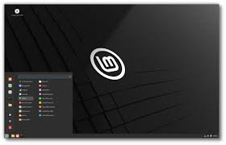
1. **Baixe o VirtualBox**: Se você ainda não tiver o VirtualBox instalado, baixe e instale a versão adequada para o seu sistema operacional a partir do site oficial: [VirtualBox Downloads](https://www.virtualbox.org/wiki/Downloads).

2. **Baixe a imagem ISO do Linux Mint**: Visite o site oficial do Linux Mint em [linuxmint.com](https://www.linuxmint.com/) e baixe a imagem ISO da edição do Linux Mint que deseja instalar. Por exemplo, você pode escolher entre Cinnamon, MATE, XFCE ou outra edição.

3. **Crie uma nova máquina virtual no VirtualBox**:
   - Abra o VirtualBox e clique em "Novo" para criar uma nova máquina virtual.
   - Siga o assistente para configurar a máquina virtual, incluindo o nome, tipo e versão do sistema operacional (Linux) e a quantidade de memória RAM alocada.
   - Quando chegar à tela de "Disco rígido", selecione "Criar um novo disco rígido virtual agora" e siga as instruções para criar um disco rígido virtual.

4. **Configure as configurações da máquina virtual**:
   - Selecione a máquina virtual que você acabou de criar na lista do VirtualBox e clique em "Configurações".
   - Vá para a seção "Armazenamento" e clique no ícone do disco vazio sob "Controladora IDE".
   - Selecione "Escolha um arquivo de disco óptico virtual" e navegue até a imagem ISO do Linux Mint que você baixou.

5. **Instale o Linux Mint na máquina virtual**:
   - Inicie a máquina virtual clicando em "Iniciar".
   - A máquina virtual deve iniciar a partir do arquivo ISO do Linux Mint que você configurou.
   - Siga as instruções na tela para instalar o Linux Mint na máquina virtual. Você pode escolher entre instalar o Linux Mint ao lado de outros sistemas operacionais (se houver) ou substituí-los.

6. **Conclua a instalação**:
   - Após a instalação, reinicie a máquina virtual.
   - O Linux Mint deve inicializar normalmente na máquina virtual. Você pode precisar instalar os "Guest Additions" do VirtualBox para ter integração total do sistema operacional com a máquina virtual.

7. **Explore e use o Linux Mint na máquina virtual**:
   - Uma vez que o Linux Mint esteja instalado e em funcionamento na máquina virtual, você pode explorar e usar o sistema operacional como faria em um computador físico.

Este processo deve permitir que você instale o Linux Mint em uma máquina virtual usando o VirtualBox. Se precisar de mais ajuda ou tiver alguma dúvida específica durante o processo, estou aqui para ajudar!

---------------------------------------------------------

## Agora a instalação do dentro do linux ja feito:

------------------------------------------------------------

### 1° Passo: Selecione a forma que você deseja baixar o linux mint.
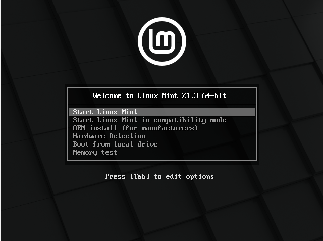

### 2° Passo: Clique no disco escrito "Install Linux Mint".
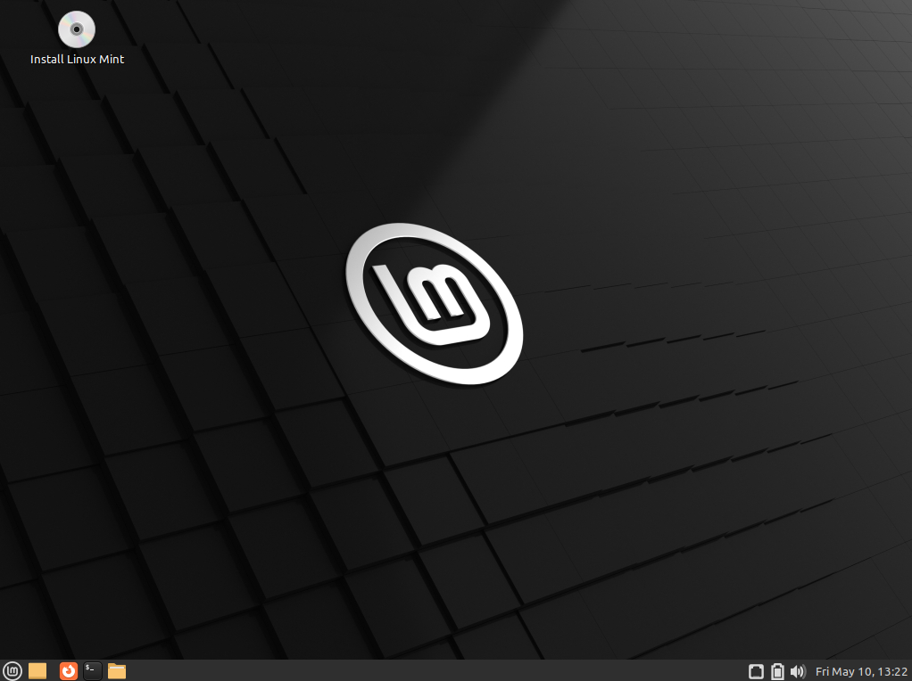

### 3° Passo: Escolha a língua que você se comunica para facilitar sua interpretação ao ler as informações do sistema.
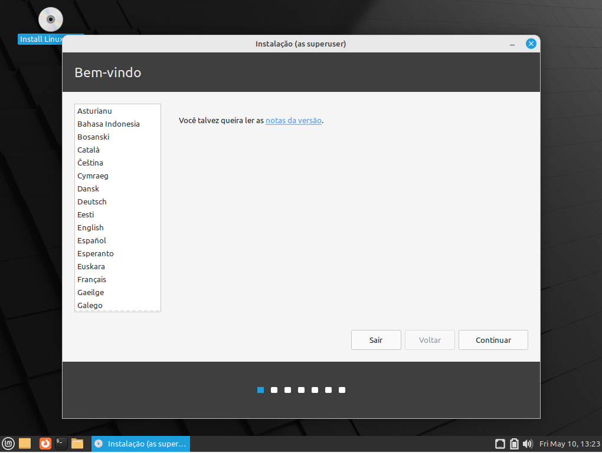

### 4° Passo: Escolha o layout do teclado você prefere ou acha mais fácil de compreender.
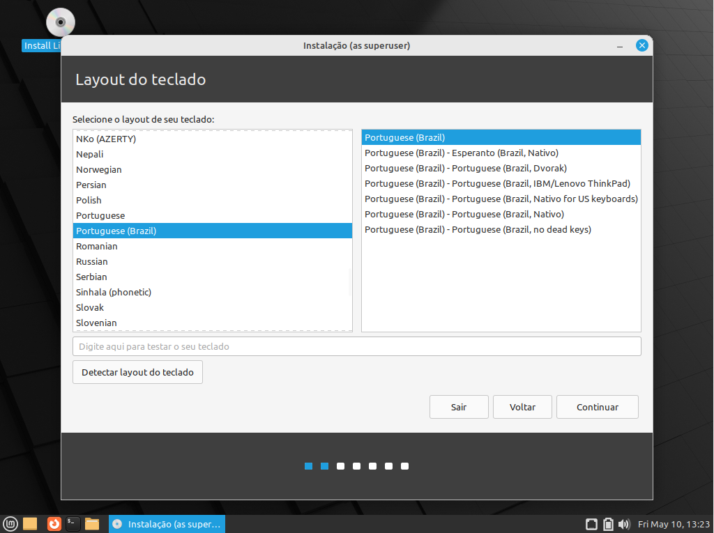

### 5° Passo: Instale o Codecs Multimídia para exibir formatos de vídeo e renderizar alguns sites da web.!
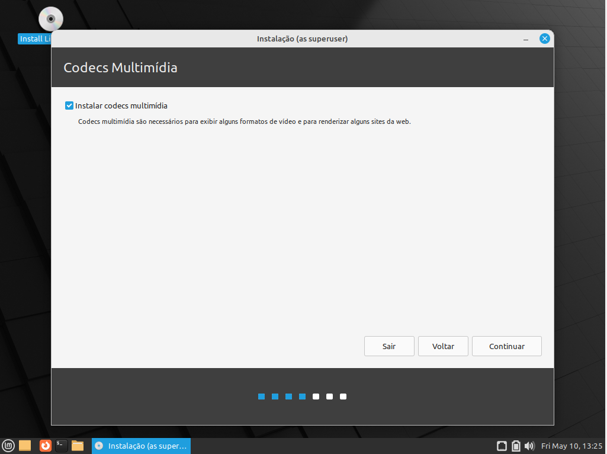

### 6° Passo: Escolha o tipo de instalação, é bom selecionar 
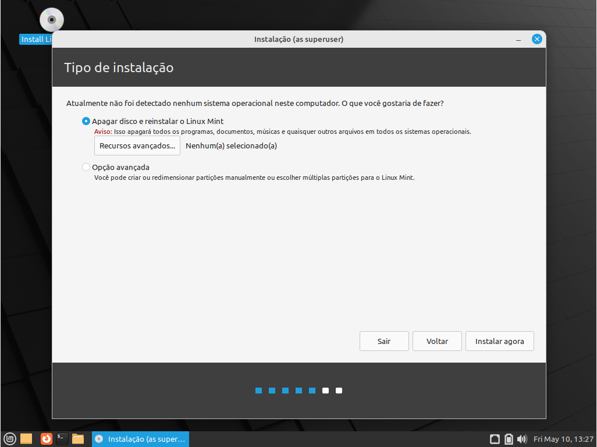

### 7° Passo: Após selecionar o tipo de instalação, clique em confirmar.
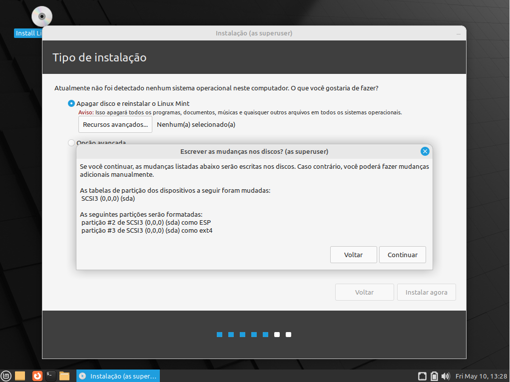

### 8° Passo: No mapa, selecione o local onde você está.
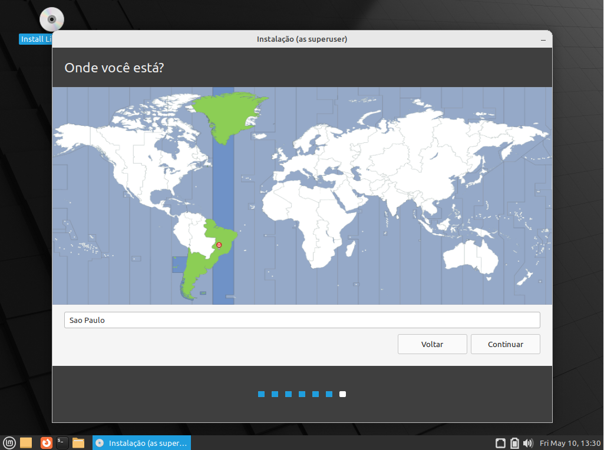

### 9° Passo: Agora apresente seu nome no computador, crie um nome para o seu computador, crie um nome de usuário, crie uma senha e reescreva a senha novamente para confirma-la.
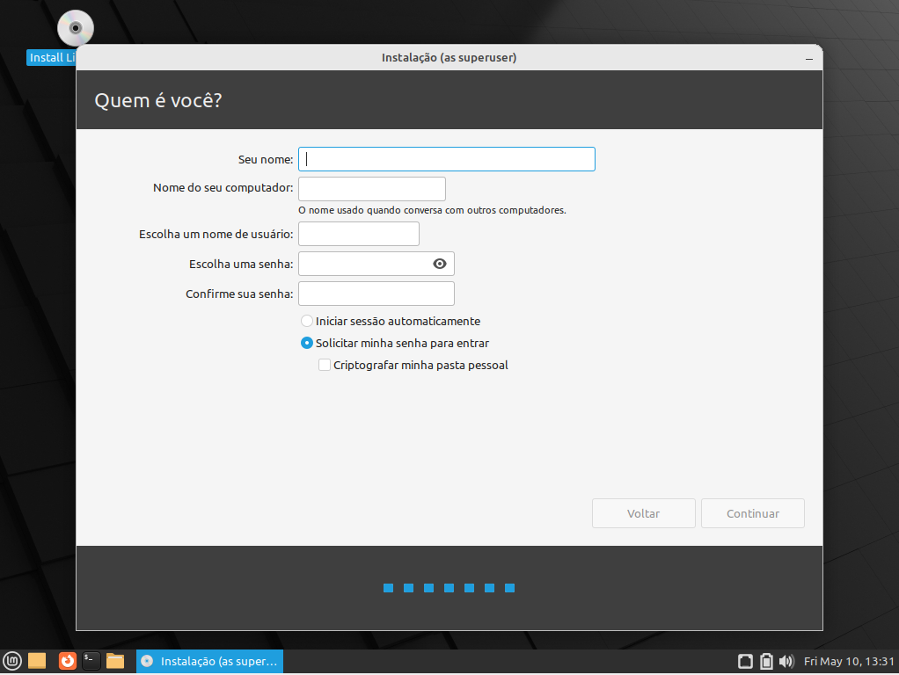

### 10° Passo: Espere carregar a instalação, e após a conclusão clique em "Reiniciar agora" para reiniciar o computador.
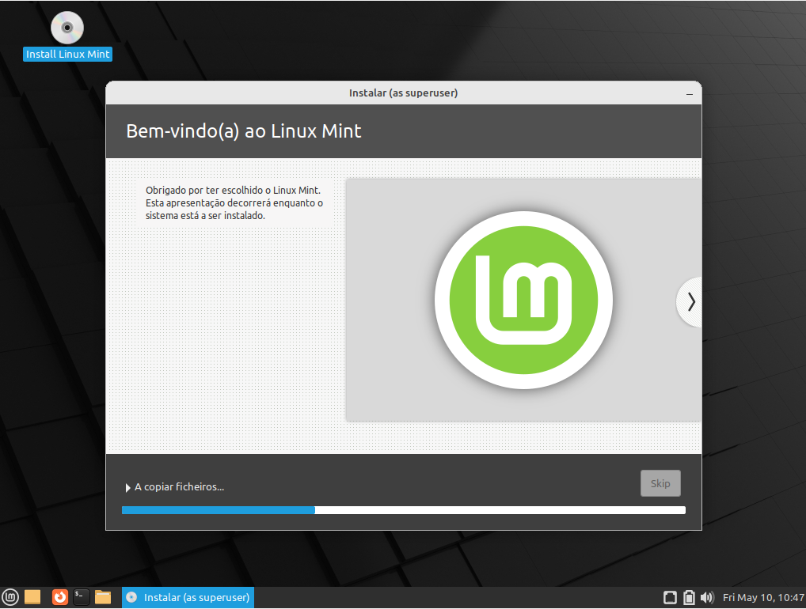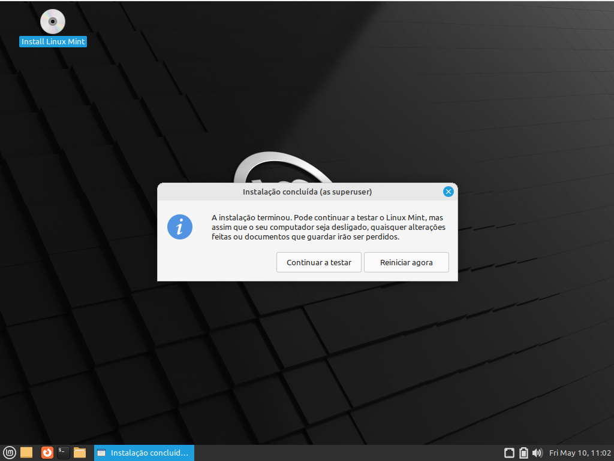

### 11° Após ser reinicializado, pressione a tecla "enter" para acionar o computador.
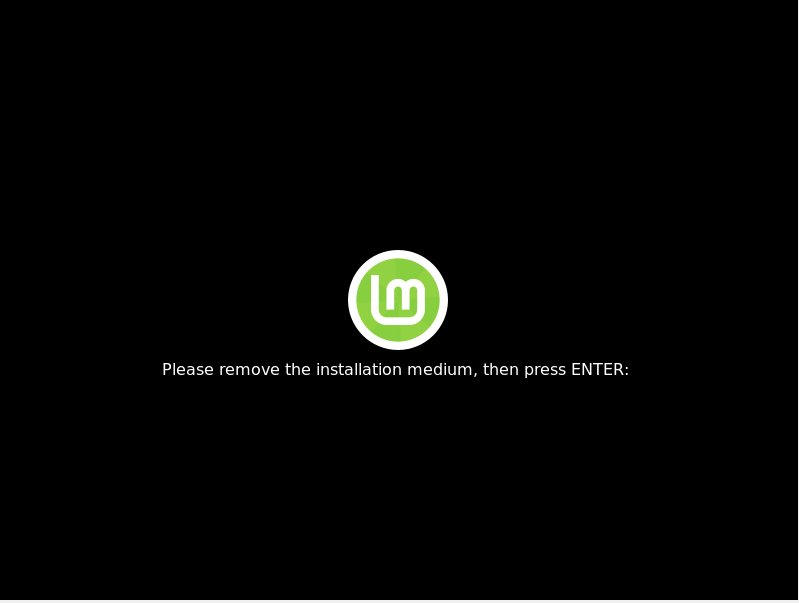

### O Linux Mint é uma distribuição Linux baseada no Ubuntu e Debian, projetada para oferecer uma experiência de computação fácil de usar, estável e completa para usuários domésticos e empresariais. Aqui estão alguns pontos-chave sobre o Linux Mint:

Objetivo de Usabilidade: O Linux Mint se destaca por sua ênfase na usabilidade e facilidade de uso. Ele é projetado para ser amigável para iniciantes, oferecendo uma interface intuitiva e familiar, especialmente para aqueles que estão migrando de sistemas operacionais como o Windows.

-----------------------------------------------------------------------

Ambientes de Desktop: O Linux Mint está disponível em várias edições, cada uma com um ambiente de desktop diferente. O ambiente de desktop mais popular do Linux Mint é o Cinnamon, que oferece uma experiência de usuário moderna e elegante, semelhante à de outros sistemas operacionais.

---------------------------------------------
Estabilidade e Confiabilidade: O Linux Mint é conhecido por sua estabilidade e confiabilidade. As equipes de desenvolvimento e teste do Linux Mint trabalham para garantir que cada versão seja robusta e livre de bugs, proporcionando uma experiência de computação tranquila.
Foco na Comunidade: O Linux Mint tem uma comunidade ativa e dedicada de usuários e desenvolvedores. A equipe por trás do Linux Mint valoriza o feedback da comunidade e trabalha para incorporar sugestões e melhorias nos lançamentos futuros.

-------------------
Software e Aplicativos: O Linux Mint vem pré-instalado com uma variedade de aplicativos essenciais, incluindo navegadores da web, clientes de e-mail, suítes de escritório e reprodutores de mídia. Além disso, através do gerenciador de pacotes do sistema, os usuários podem facilmente instalar uma ampla gama de aplicativos adicionais.
Personalização: O Linux Mint oferece várias opções de personalização, permitindo que os usuários adaptem o sistema operacional às suas preferências individuais. Isso inclui a capacidade de alterar temas, ícones, papéis de parede e muito mais.

--------------------------
Suporte de Longo Prazo: O Linux Mint oferece versões de suporte de longo prazo (LTS), que são atualizadas regularmente com correções de segurança e atualizações de software por vários anos após o lançamento inicial. Isso proporciona aos usuários uma plataforma estável e segura para suas necessidades de computação.
Em resumo, o Linux Mint é uma escolha 
popular para aqueles que procuram um sistema operacional Linux amigável, estável e altamente personalizável. Com sua comunidade ativa, desenvolvimento contínuo e foco na usabilidade, o Linux Mint continua a ganhar destaque como uma das principais distribuições Linux disponíveis.

----------------------------------------------

Filosofia e Abordagem: O Linux Mint segue uma filosofia centrada no usuário, onde a facilidade de uso e a estabilidade são priorizadas. Os desenvolvedores se esforçam para criar um ambiente de computação que seja acessível para todos, independentemente do nível de habilidade técnica. Isso se reflete em escolhas de design, recursos e políticas de atualização.

------------------------------------------------------------------
Comunidade Ativa e Suporte: Uma das forças do Linux Mint é sua comunidade ativa de usuários e desenvolvedores. Fóruns de suporte, wikis e canais de mídia social proporcionam um espaço para os usuários compartilharem experiências, fazerem perguntas e receberem assistência. A equipe do Linux Mint também mantém uma presença ativa nessas plataformas para fornecer suporte direto e responder às perguntas dos usuários.

---------------------------------------------------------------
Gerenciador de Atualizações e Política de Segurança: O Linux Mint possui seu próprio gerenciador de atualizações, que simplifica o processo de aplicação de atualizações de segurança e software. Além disso, o Linux Mint segue uma política de segurança conservadora, priorizando a estabilidade sobre as atualizações mais recentes. Isso significa que as atualizações de software são testadas extensivamente antes de serem disponibilizadas para os usuários, reduzindo o risco de problemas de compatibilidade ou instabilidade.

-------------------------------------------------------

Compatibilidade de Hardware: O Linux Mint é conhecido por sua excelente compatibilidade de hardware. Ele suporta uma ampla gama de dispositivos, desde hardware antigo até hardware mais recente. Isso é facilitado pelo suporte a drivers proprietários e pela integração de tecnologias que facilitam a detecção e configuração automática de hardware.

-------------------------------------------------------------------------
Ferramentas de Configuração e Administração: O Linux Mint oferece várias ferramentas de configuração e administração que simplificam tarefas comuns, como gerenciamento de rede, configuração do sistema, monitoramento de hardware e muito mais.
 Essas ferramentas são projetadas para serem intuitivas e fáceis de usar, permitindo que os usuários personalizem e gerenciem seus sistemas conforme necessário.

----------------------------------------------------------------------
Em resumo, o Linux Mint é mais do que apenas uma distribuição Linux; é uma comunidade vibrante e uma plataforma de computação completa que prioriza a usabilidade, estabilidade e compatibilidade.

----------------------------------------------------------
Com seu foco no usuário, suporte robusto e políticas de atualização cuidadosas, o Linux Mint continua a ser uma escolha popular para usuários de todos os níveis de habilidade em todo o mundo.

# passo-a-passo-linuxmint-virtualbox
